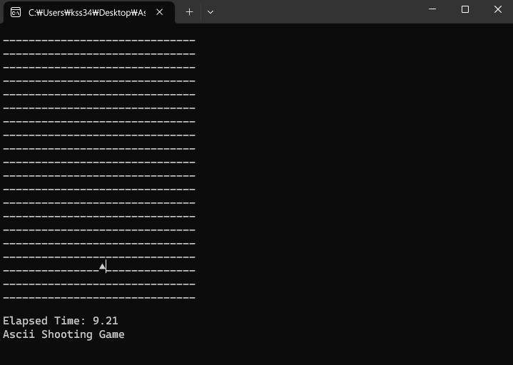

# ASCII Shooting Game with C++ and SDL Library
[2017-03-24] Ascii Shooting Game with C++ and SDL Library

### 프로그램 개발 환경
- Language : C++
- OS : Microsoft Windows 10
- IDE : Microsoft Visual Studio 2017 15.0

### 기능 설명
- C++와 SDL 라이브러리를 사용하여 간단하게 제작한 ASCII 슈팅 게임
- 키보드의 방향키 `[←]`, `[→]`, `[↑]`, `[↓]`를 이동하여 객체(`▲`)움직일 수 있다.
- `[Space]`를 누르면 미사일(`†`)이 발사된다.

### 프로그램 실행 방법
- Visual Studio 에 **[SDL 라이브러리](https://github.com/libsdl-org/SDL/releases)** 연동

### 실행 화면

